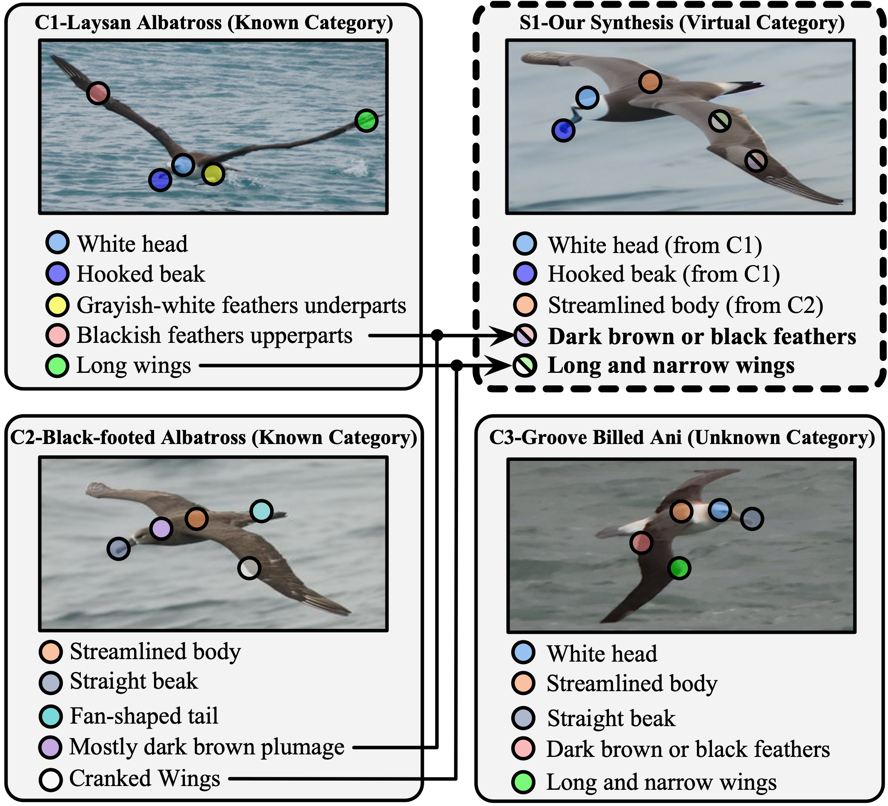

# Generate, Refine, and Encode: Leveraging Synthesized Novel Samples for On-the-Fly Fine-Grained Category Discovery

This repository contains PyTorch implementation for the paper __Generate, Refine, and Encode: Leveraging Synthesized Novel Samples
for On-the-Fly Fine-Grained Category Discovery__

In this paper, we investigate a practical yet challenging task: On-the-fly Category Discovery (OCD). This task focuses on the online identification of newly arriving stream data that may belong to both known and unknown categories, utilizing the category knowledge from only labeled data. Existing OCD methods are devoted to fully mining transferable knowledge from only labeled data. However, the transferability learned by these methods is limited because the knowledge contained in known categories is often insufficient, especially when few annotated data/categories are available in fine-grained recognition. To mitigate this limitation, we propose a diffusion-based OCD framework, dubbed DiffGRE, which integrates Generation, Refinement, and Encoding in a multi-stage fashion. Specifically, we first design an attribute-composition generation method based on cross-image interpolation in the diffusion latent space to synthesize novel samples. Then, we propose a diversity-driven refinement approach to select the synthesized images that differ from known categories for subsequent OCD model training. Finally, we leverage a semi-supervised leader encoding to inject additional category knowledge contained in synthesized data into the OCD models, which can benefit the discovery of both known and unknown categories during the on-the-fly inference process. Extensive experiments demonstrate the superiority of our DiffGRE over previous methods on six fine-grained datasets.

## License
This code is distributed under an [MIT LICENSE](LICENSE).

